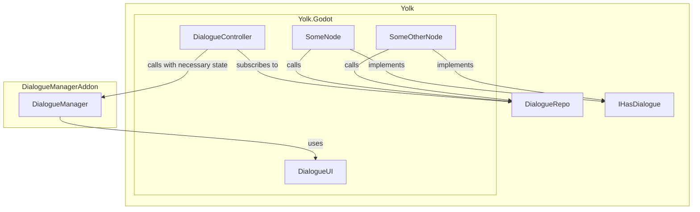

# Dialogue in Yolk

This document aims to describe and formulate the requirements, the chosen tools and the intended architecture for handling dialogues in the game Yolk.

## Requirements

The game demo requires the following points:

- Dialogues must allow non-linearity
- Dialogues can check for game state
  - Does the player have a certain item?
  - Has the player completed a certain objective?
- Dialogues can mutate game state, such as:
  - Consume an item from the player
  - Unlock a door
- Dialogues can be initiated by any node, from anywhere in the scene tree.

## Tools

The game will use the Chickensoft architecture along with the Dialogue Manager addon by Nathan Hoad. 

## Architecture

Since the addon requires game state to be Godot variants, there must be a bridge somewhere to translate the game domain to the Godot domain.

